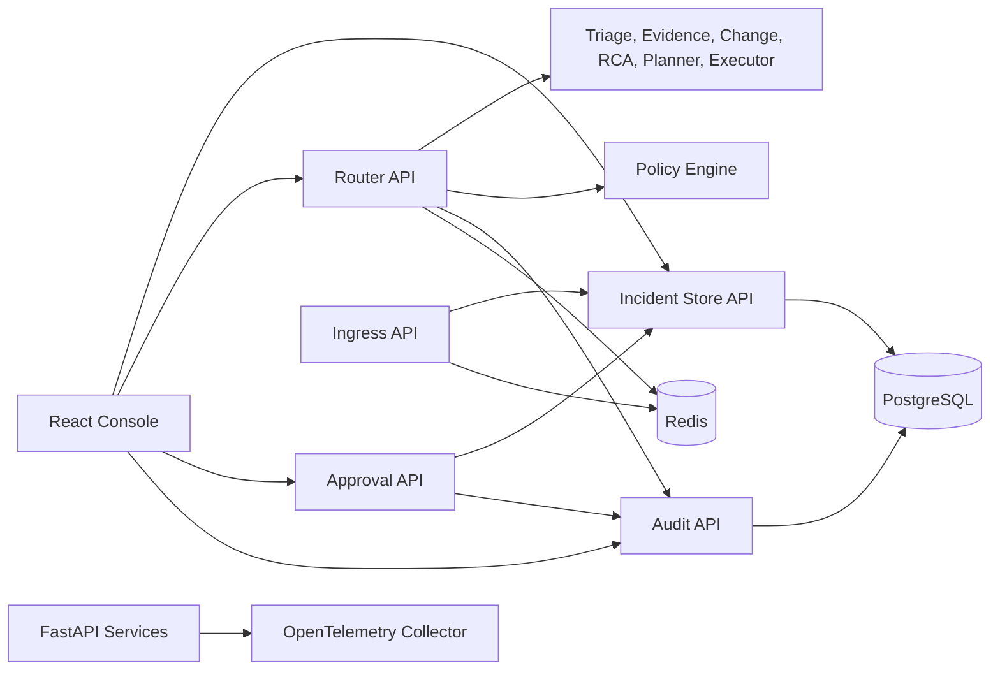

# AI-Assisted AWS Incident Management and Operational Resilience Platform

An incident-management and operational-resilience lab for demonstrating how critical workloads can be monitored, triaged, routed, governed, approved, executed, and audited.

The project combines FastAPI services, policy controls, incident state management, audit history, OpenTelemetry hooks, and a React operator console. It is currently optimized for local development and portfolio evaluation, with stubbed adapters for telemetry and execution.

## What This Project Does

- Ingests alerts and normalizes them into incident records.
- Routes incidents through triage, evidence collection, change correlation, RCA, and response planning.
- Applies policy and approval controls before remediation actions.
- Tracks incident state, workflow checkpoints, execution traces, approvals, and audit events.
- Provides a browser console for operators to inspect incidents, plans, approvals, replay scores, and audit history.
- Supports optional LLM-assisted routing through server-side configuration.

## Architecture



## Recommended Folder Structure

The target project structure follows the redesign recommended in `files/ExecutiveAssessment.md`. Existing modules should be migrated into this layout gradually.

```text
/
├── apps/
│   ├── api/
│   │   ├── main.py
│   │   ├── routers/
│   │   └── dependencies/
│   ├── worker/
│   │   ├── main.py
│   │   └── jobs/
│   └── console/
│       └── React application
├── src/
│   ├── domain/
│   │   ├── incidents/
│   │   ├── actions/
│   │   ├── approvals/
│   │   └── policies/
│   ├── workflows/
│   ├── agents/
│   ├── ports/
│   │   ├── telemetry.py
│   │   ├── changes.py
│   │   ├── actions.py
│   │   └── notifications.py
│   ├── adapters/
│   │   ├── local/
│   │   ├── aws/
│   │   └── llm/
│   ├── persistence/
│   ├── observability/
│   └── security/
├── scenarios/
│   └── checkout-deployment-regression/
├── sample-workload/
│   └── checkout-service/
├── policies/
│   ├── demo/
│   └── production/
├── migrations/
├── tests/
│   ├── unit/
│   ├── contract/
│   ├── integration/
│   ├── e2e/
│   └── resilience/
├── infra/
│   ├── local/
│   └── aws/
├── docs/
├── docker-compose.yml
├── Makefile
└── README.md
```

Current code still lives in the original `services/`, `agents/`, `libs/`, `adapters/`, and `ui/console/` folders. The README uses the recommended structure as the intended end state, not as a claim that every module has already been moved.

## Prerequisites

- Python 3.11 recommended
- Node.js 18 or newer
- Docker Desktop
- Git
- PowerShell on Windows

An OpenAI or other LLM-compatible API key is optional. The platform can run with stub fallback behavior for local evaluation.

## Quick Start

From the repository root:

```powershell
python -m venv .venv
.\.venv\Scripts\Activate.ps1
python -m pip install --upgrade pip
pip install -e ".[dev]"
```

Copy the backend environment template:

```powershell
Copy-Item .env.example .env
```

Start infrastructure dependencies:

```powershell
docker compose -f docker-compose.dev.yml up -d
```

Run database migrations:

```powershell
alembic upgrade head
```

Start the backend services:

```powershell
.\tests\start-backend-services.ps1
```

Start the console:

```powershell
cd ui\console
npm install
npm run dev
```

Open the console:

```text
http://localhost:5173
```

## Local Service Ports

| Service | Port | Health check |
| --- | ---: | --- |
| Ingress API | 8001 | `http://127.0.0.1:8001/healthz` |
| Incident Store API | 8002 | `http://127.0.0.1:8002/healthz` |
| Router API | 8003 | `http://127.0.0.1:8003/healthz` |
| Policy Engine API | 8004 | `http://127.0.0.1:8004/healthz` |
| Approval API | 8005 | `http://127.0.0.1:8005/healthz` |
| Audit API | 8006 | `http://127.0.0.1:8006/healthz` |
| Console | 5173 | `http://localhost:5173` |

## Try a Smoke Test

After Docker, migrations, backend services, and the console are running:

```powershell
.\tests\smoke-test.ps1
```

The smoke test checks container status, service health endpoints, incident ingestion, incident listing, audit listing, and replay scoring.

## Useful Commands

Backend:

```powershell
make lint
make typecheck
make test
make replay
```

Frontend:

```powershell
cd ui\console
npm run dev
npm run build
npm run preview
```

Docker dependencies:

```powershell
docker compose -f docker-compose.dev.yml up -d
docker compose -f docker-compose.dev.yml ps
docker compose -f docker-compose.dev.yml down
```

## Configuration

Backend configuration lives in `.env`. Start from `.env.example`.

Important settings:

| Variable | Purpose |
| --- | --- |
| `POSTGRES_DSN` | PostgreSQL connection string |
| `REDIS_URL` | Redis connection string |
| `OTEL_EXPORTER_OTLP_ENDPOINT` | OpenTelemetry collector endpoint |
| `AGENTIC_ENABLED` | Enables server-side LLM-assisted behavior |
| `LLM_BASE_URL` | LLM-compatible API base URL |
| `LLM_MODEL` | Model name |
| `LLM_API_KEY` | Server-side API key; never expose this to the frontend |
| `EXECUTE_ACTION_DRY_RUN` | Forces execution actions to dry-run mode |
| `CORS_ALLOW_ORIGINS` | Allowed browser origins for local console access |

Frontend configuration lives in `ui/console/.env` when overrides are needed. The default Vite setup proxies `/api/*` routes to the local backend ports.

## Current Capabilities

- Structured incident domain models and state transitions.
- Incident deduplication through Redis hot state.
- Response routing through specialized agents.
- Policy evaluation and approval records.
- Audit event storage and retrieval.
- OpenTelemetry instrumentation hooks.
- Replay scoring for routing quality.
- React console for operational workflows.

## Current Limitations

This repository is still a local lab, not a production-ready AWS operations platform.

- Docker Compose currently starts only PostgreSQL, Redis, and the OpenTelemetry collector.
- Backend services are started separately with `tests/start-backend-services.ps1`.
- Telemetry and change-feed adapters default to stubs.
- Execution adapters are not yet real AWS remediation integrations.
- Post-action verification is still limited.
- LLM mode requires server-side credentials and should be treated as optional.
- Authentication and role-based approval controls are incomplete.

See [files/ExecutiveAssessment.md](files/ExecutiveAssessment.md) for the full project assessment and recommended roadmap.

## Recommended Evaluation Flow

1. Start the local stack with the quick-start steps.
2. Run `.\tests\smoke-test.ps1`.
3. Open `http://localhost:5173`.
4. Ingest or inspect incidents.
5. Route an incident through the router service.
6. Review policy decisions, approvals, execution traces, and audit events in the console.

## Roadmap

The next high-value improvements are:

- Add a one-command `make demo` startup path.
- Add a deterministic checkout-service failure scenario.
- Replace fake-success execution behavior with a local workload adapter.
- Add real recovery verification before resolving incidents.
- Add narrow AWS adapters for CloudWatch and ECS.
- Add durable idempotency and stricter approval-token enforcement.
- Add operational-readiness documents, executive reporting, and resilience game-day artifacts.
- Add CI for backend, frontend, integration, and security checks.
